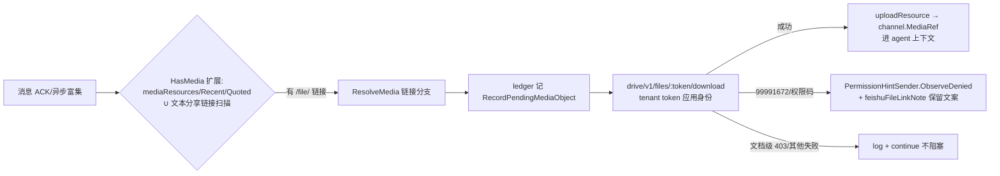

# ADR 005：飞书云文件分享链接读取——独立 capability 设计（RUYI-572）

- 日期：2026年10月08日
- 状态：proposed（方案段交付；Stage 2 实施以 Leader 对本文档的裁定与 RUYI-546 合入 main 为前提）
- 范围：`server/internal/integrations/lark/`（permission catalog、media ingest、inbound enricher、http client）、`packages/views/settings/components/lark-tab.tsx` 及四语言 locale。
- 执行原则（Owner 2026-10-08 指令，沿 RUYI-546）：scope 由实际调用的 endpoint 反推并附官方依据，禁止先拍 scope 再让代码适配；不冒称「cc-connect 已支持」。

## 1. 背景与问题

RUYI-448 已确认：裸 `/file/` 分享链接在飞书 UI 渲染为文件卡片，但经 API 到达时是 `msg_type=text` 的纯 URL——没有 `file_key`，消息附件管线（`media_resources`）捕获不到；直接 GET 该 URL 会 302 到登录页。现状仅 `inbound_enricher.go` 的 `feishuFileLinkNote` 注入降级提示。本单把「读不了」升级为「能读」：链接识别 → token 解析 → Drive/Docs API → 上下文注入，作为独立 capability 设计，不混入 `media_resources`（后者语义是「带 message_id+file_key 的真消息附件」）。

## 2. 链接识别与安全解析边界

- **识别面**：抽出 `isBareFeishuFileLink` 的 host 判定为共用函数（`feishu.cn` / `larksuite.com` 及子域白名单，大小写不敏感），按 path 前缀分类链接族：`/file/<token>`（云盘文件）、`/docx/<token>`、`/wiki/<token>`、`/docs/<token>`、`/sheets/<token>`、`/base/<token>`、`/mindnotes/<token>`。扫描对象：text 正文、post 文本 run、引述块父消息、近期上下文窗口文本（与 `HasMedia` 的覆盖面对齐）。
- **token 解析**：仅取 URL path 段，token 校验 `[A-Za-z0-9]{1,64}`，query/fragment 一律丢弃；解析失败按「非分享链接」处理（无提示、log-only）。
- **安全边界**：token 只作为 OpenAPI 请求的 path 参数，经既有 `httpAPIClient`（固定 base URL + tenant_access_token 应用身份）发出；禁止对分享页 URL 本身发起抓取（302 登录页无收益，且引入不可控外呼面）——无 SSRF 面。文件名取自下载响应 `content-disposition`，过滤路径分隔符后才入 `MediaRef`。
- **两级权限现实**：API scope 之外还有文档级权限（应用须在文档访问范围内/被添加为协作者）。文档级 403 是预期路径而非异常，走降级分支（§7）。

## 3. endpoint 选型与官方权限依据锚点

| 链接族 | endpoint | scope 要求（组内任一） | 取证方式 |
| --- | --- | --- | --- |
| `/file/` 云盘文件（MVP） | `GET /open-apis/drive/v1/files/{file_token}/download` | `drive:drive` / `drive:drive:readonly` / `drive:file` / `drive:file:readonly`「开启其中任意一项权限即可调用」；仅云盘文件夹内文件（在线文档/表格/思维笔记不适用）；5 QPS/app；返回二进制流 + content-disposition | 本 run 官方页直抓 |
| wiki 路由 | `GET /open-apis/wiki/v2/spaces/get_node?token=<wiki_token>` | `wiki:wiki` / `wiki:wiki:readonly` + 节点级阅读权限；返回 `obj_type`/`obj_token`（docx/sheet/file/bitable/mindnote 路由表） | 本 run 官方页直抓 |
| docx 纯文本 | `GET /open-apis/docx/v1/documents/{document_id}/raw_content` | `docx:document:readonly`（「查看新版文档：获取新版文档内容」）/ `docx:document`（官方权限表注明包含前者全部授权）；5 QPS | 双重印证：官方权限表行语义（feishu.apifox.cn 官方镜像 doc-1939254）+ 官方社区文章 7293415563448238084 的 API 读取权限清单；官方参考页 JS 渲染无法直抓，QA live test 复核 |
| 老文档/表格导出 | `POST /open-apis/drive/v1/export_tasks` → `GET .../export_tasks/{ticket}` → `GET .../export_tasks/file/{file_token}/download` | `drive:export:readonly`（「导出云文档」行关联创建/查询/下载三 API） | 双重印证：官方镜像权限表行；QA live test 复核 |

选型说明：`/file/` 族取二进制直下（响应自带文件名与类型），不另调 metas 端点，scope 面最小；docx 族首选 `raw_content`（纯文本直出、最贴上下文注入语义），老格式（doc/sheet）走 export 任务为后备路径。文件名/类型解析自下载响应头，不扩 scope。

## 4. 独立 capability 定义

沿 ADR 004 的 catalog 单一事实源（`permission.go`，AND-of-OR + 三态 probe）新增：

```go
CapabilityDriveFileLinks CapabilityID = "drive_file_links"
// catalog 条目：
{CapabilityDriveFileLinks, [][]string{
    {"drive:drive", "drive:drive:readonly", "drive:file", "drive:file:readonly"},
}, true},
```

- **为何单列 capability 而非并入 `media_resources`**：二者 endpoint、scope 族、失败语义完全不同；并入会把「读云盘文件」的 scope 要求强加给只收附件的安装，且 probe 目标无法共用。
- **为何 MVP 只立 `/file/` 一族**：catalog 的 AND-of-OR 表达「本 capability 全部 endpoint 的权限交集」。wiki/docx 链接需要 wiki 组 ∩ docx 组（get_node 解析出的 obj_token 仍要过 docx 读权限），是另一族 endpoint 集合；混入同一 capability 会迫使 `/file/` 安装连带申请 docx/wiki scope。族与 capability 一一对应，后续 `wiki_doc_links` 另立条目（见 §8 决策 1）。
- **probe 设计**：合成 file_token（如 `drive_probe_capability_check`）调 download，复用 `classifyProbeError`。注意点：drive 族「文件不存在」业务码在 106xxxx 段（如 1061004），不在现有 23xxxx「已过网关」判定带内——需为该族扩展 granted 判定码段（集中改 `classifyProbeError`，单测钉住）；99991672 仍判 missing。具体码值以 QA live test 校准，本条进入 §9 复核清单。

## 5. 与 media_ingest / 上下文注入链路的整合点

复用引擎 `MediaResolver` 全链，不新增旁路：



- `feishuMediaResolver.HasMedia`（同步 ACK 路径）追加链接扫描：纯字符串操作无 I/O，不加重 ACK 延迟；`ResolveMedia`（异步）按既有 ledger→下载→上传→MediaRef 契约执行。
- `feishuFileLinkNote`（RUYI-448）降级为「capability 缺失/权限失败」分支的固定文案；granted 时同一位置由真实文件内容（MediaRef）替代。
- 安装面板/补授权链（handler → capability_state → permission_hint）由 catalog 驱动自动带出新行，无需改 handler 代码。

## 6. 与 CC Connect 复用/分叉对照

基线：`cfgxy/cc-connect` 本地检出（分支 `guxy`，tip `9397f066d34ee1ceaec39f1807d1d27512596745`，只读）。`platform/feishu/` 对 `/file/` 正文链接与 `drive/v1|docx/v1|wiki/v2|drive/v2` 端点零使用（`git grep` 已核）——该能力在 CC Connect 不存在，本设计为**全量新增**，无复用项、无分叉项；下载后注入复用 Multica 既有 `media_ingest` 面，是架构内适配而非对 CC 的分叉。

## 7. 降级行为矩阵（不阻塞消息流）

| 场景 | 行为 |
| --- | --- |
| capability missing（probe 判定或运行时 99991672/99991002） | 保留 `feishuFileLinkNote` 现文案 + `ObserveDenied` 驱动补授权提示 |
| scope 已授但文档级 403（非协作者/不在访问范围） | 注入提示「应用无该文档访问权限，请添加为文档协作者或改以附件发送」 |
| token 解析失败 / 非白名单域 / 非链接文本 | 无提示、log-only（现状不变） |
| 下载/上传运行失败（网络、5 QPS 限流） | 沿用 `media_ingest` 既有 log+continue 契约，ledger 对账收口 |

全部分支均不阻塞消息流；引述块/正文中的 URL 原文保持逐字保留。

## 8. 待决点（Stage 2 实施边界，报 Leader 裁定）

- **决策 1：本期 capability 覆盖面**
  - A（推荐）：仅 `/file/` 云盘文件族（`drive_file_links`，§4 全量）——权限行直抓证据完整、probe 语义干净、直击 RUYI-448 事故类（HCM xlsx 即云盘文件链接）；验收标准即为此族。wiki/docx 另立后续单。
  - B：A 之上同期加 `wiki_doc_links`（wiki get_node + docx raw_content，AND 两组）——docx/export 两行 scope 仅有双重印证，实现面与 QA 面翻倍，两级权限降级路径复杂。
- **决策 2：wiki/docx 链接的降级文案**
  - A（推荐）：维持现状（仅引述块内 bare `/file/` 有 note），wiki/docx 链接不注入提示。
  - B：把 note 扩到 wiki/docx 链接（「请以附件形式发送」类提示）——纯文案低风险，但引述块判定边界需再核一轮。

## 9. 验证边界与 QA live test 复核清单

- Stage 1 自测：本文档证据链复核 + catalog/probe 现状静态核对，已闭环。
- Stage 2 单元测试面：catalog 新行形状、`classifyProbeError` drive 族扩展码、链接扫描函数（正/反/边界）、download client 方法、HasMedia/ResolveMedia 分支、lark-tab case 与四 locale key。
- QA live test 复核项：① docx `raw_content` 与 export 三 API 的 scope 行官方直抓补证；② drive 族 probe 业务码段校准；③ 真实安装按 §3 表逐族验证 granted/missing/文档级 403 三态与降级文案。
- 实施前提：基线须为 RUYI-546（`942e8fbfdd62556291dfde0f6e13b3fe43b5366b`，含 catalog `media_resources` scope 校正）已合入的 main；当前 main（`1ebcc7d35cafb37a4e75ea2caebc517ba86aa06a`）未含，Stage 2 开工前按分派卡向 Leader 报序列。
